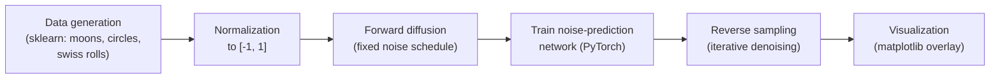

# Little Diffusion Model

A from-scratch implementation of a Denoising Diffusion Probabilistic Model (DDPM),
following Ho, Jain, and Abbeel's original paper, trained to generate 2D synthetic
patterns (moons, circles, swiss rolls) and visualized by comparing the model's learned
samples against the real data distribution.

## How it works



### 1. Data generation and processing

Synthetic 2D point patterns are generated with **scikit-learn** (`make_moons`,
`make_circles`, `make_blobs`, `make_swiss_roll`). Each pattern is a scatter of points in
2D space rather than an image, which keeps training fast and makes every step of the
diffusion process directly visualizable as points moving around a plane.

Each dimension (x and y) is independently **min-max normalized to the range [-1, 1]**:

```python
x_coords = (x_coords - x_coords.min()) / (x_coords.max() - x_coords.min()) * 2 - 1
```

Normalizing to a fixed, symmetric range matters because the forward diffusion process
gradually blends the data with standard Gaussian noise — if the data weren't scaled
consistently, the noise schedule would corrupt some patterns much faster than others,
making training unstable across different datasets.

### 2. The forward diffusion process

Diffusion models are trained by learning to *reverse* a fixed, known process that
slowly destroys data by adding noise. A **variance schedule** defines how much noise is
added at each of `T` discrete timesteps:

```python
betas = torch.linspace(1e-4, 0.02, steps=noise_steps)
alphas = 1 - betas
alpha_bars = torch.cumprod(alphas, dim=0)
```

Because the schedule is fixed and Gaussian, there's a closed-form shortcut: rather than
adding noise step by step, the data can be noised directly to *any* timestep `t` in one
calculation:

$$
x_t = \sqrt{\bar\alpha_t}\, x_0 + \sqrt{1-\bar\alpha_t}\, \epsilon, \qquad \epsilon \sim \mathcal{N}(0, I)
$$

This is exactly what happens during training: a random timestep and a random noise
sample are drawn, the clean data point is noised to that timestep, and the model is
asked to recover the noise that was added.

### 3. Training

The network (`model.py`) is a small MLP that takes a noised 2D point plus a normalized
timestep (`t/T`) as a 3-dimensional input, and outputs a predicted 2D noise vector. The
training loop (`training.py`) implements the standard DDPM objective:

- Sample a random timestep `t` and Gaussian noise `ε` for each point in the batch.
- Noise the data to timestep `t` using the closed-form equation above.
- Feed the noised point and timestep into the network to predict `ε`.
- Minimize the **mean squared error** between the predicted and true noise.

Training runs for 100,000 epochs with a noise schedule of 2,000 timesteps, using the
Adam optimizer — deliberately large numbers, since the underlying network is small and
the 2D data is simple enough to train quickly even at this scale.

### 4. Reverse sampling and visualization

Generation reverses the process: starting from pure Gaussian noise, the model
iteratively denoises the sample one timestep at a time, using the trained network's
noise prediction at each step:

$$
x_{t-1} = \frac{1}{\sqrt{\alpha_t}}\left(x_t - \frac{1-\alpha_t}{\sqrt{1-\bar\alpha_t}}\,\hat\epsilon_\theta(x_t, t)\right) + \sqrt{\beta_t}\, z
$$

where `z` is fresh Gaussian noise at every step except the last. Running this from
`t = T` down to `t = 0` gradually turns random noise into a sample that resembles the
training distribution.

`Display.py` runs this sampling process on a trained model and plots the generated
points directly against the real data distribution, producing a side-by-side scatter
plot that visually confirms whether the model has learned the target pattern's shape.

## Current status and roadmap

- **Working today:** data generation and normalization, the full forward/training
  loop, and reverse sampling with a local matplotlib comparison plot (`Display.py`).
- **In progress:** a browser-based visualizer (p5.js + ONNX Runtime Web) intended to
  animate the reverse denoising process step by step, with the trained model already
  exported to ONNX (`export_onnx.py`) — the frontend integration itself is not yet
  working.
- **Next steps:** replace the small dense network with a U-Net backbone to scale from
  2D point patterns to image generation, and serve the larger model through a Flask
  backend once client-side inference is no longer practical at that scale.

## Tech stack

Python · PyTorch · scikit-learn · matplotlib · ONNX (export, in progress) ·
JavaScript / p5.js (in progress)

## Repository structure

| File | Purpose |
| --- | --- |
| `dataset.py` | Generates and normalizes 2D synthetic patterns |
| `model.py` | The noise-prediction network (dense MLP) |
| `training.py` | Forward diffusion, the training loop, and reverse sampling |
| `Main.py` | Entry point for training a pattern |
| `Display.py` | Loads a trained model, runs reverse sampling, and plots results against the real data |
| `export_onnx.py` | Exports trained weights to ONNX (for the in-progress web visualizer) |
| `webapp/` | Browser-based visualizer — in progress, not yet working |

## Getting started

```bash
git clone https://github.com/humaspasta/Little_Diffusion_Model.git
cd Little_Diffusion_Model
pip install -r requirements.txt
python Main.py        # trains a model on the configured pattern
python Display.py      # samples from a trained model and plots the result
```

## Notes

This implementation follows *Denoising Diffusion Probabilistic Models* (Ho, Jain,
Abbeel, 2020), adapted to small 2D synthetic datasets rather than images. Training on
points instead of pixels keeps iteration fast and makes every part of the diffusion
process — forward noising, learned denoising, and final sample quality — directly
visible as points moving in a 2D plane.
